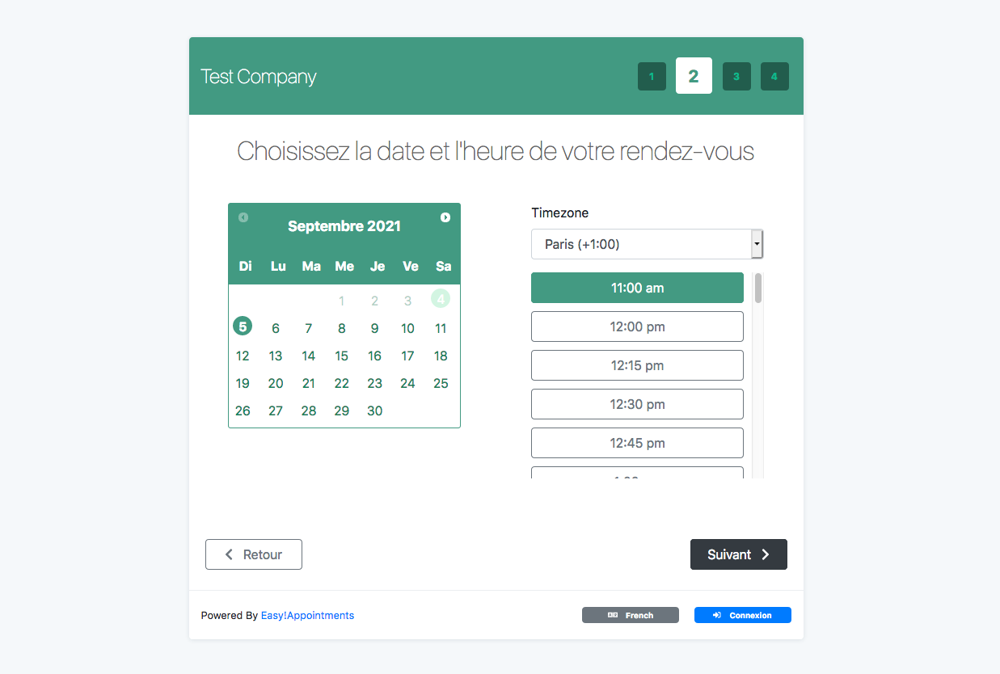

<!--
N.B.: This README was automatically generated by https://github.com/YunoHost/apps/tree/master/tools/README-generator
It shall NOT be edited by hand.
-->

# Easy!Appointments for YunoHost

[](https://dash.yunohost.org/appci/app/easyappointments)    
[](https://install-app.yunohost.org/?app=easyappointments)

*[Lire ce readme en français.](./README_fr.md)*

> *This package allows you to install Easy!Appointments quickly and simply on a YunoHost server.
If you don't have YunoHost, please consult [the guide](https://yunohost.org/#/install) to learn how to install it.*

## Overview

Easy!Appointments is a highly customizable web application that allows customers to book appointments with you via a sophisticated web interface. Moreover, it provides the ability to sync your data with Google Calendar so you can use them with other services. It is an open source project that you can download and install even for commercial use. Easy!Appointments will run smoothly with your existing website as it can be installed in a single folder of the server and of course share an existing database.

### Features
The application is designed to be flexible enough so that it can handle any enterprise work flow.

- Customers and appointments management.
- Services and providers organization.
- Working plan and booking rules.
- Google Calendar synchronization.
- Email notifications system.
- Self hosted installation.
- Translated user interface.
- User community support.

**Shipped version:** 1.4.2~ynh1

**Demo:** https://demo.easyappointments.org/

## Screenshots



## Documentation and resources

* Official app website: https://easyappointments.org/
* Official admin documentation: https://easyappointments.org/docs.html#1.4.1/readme.md
* Upstream app code repository: https://github.com/alextselegidis/easyappointments
* YunoHost documentation for this app: https://yunohost.org/app_easyappointments
* Report a bug: https://github.com/YunoHost-Apps/easyappointments_ynh/issues

## Developer info

Please send your pull request to the [testing branch](https://github.com/YunoHost-Apps/easyappointments_ynh/tree/testing).

To try the testing branch, please proceed like that.
```
sudo yunohost app install https://github.com/YunoHost-Apps/easyappointments_ynh/tree/testing --debug
or
sudo yunohost app upgrade easyappointments -u https://github.com/YunoHost-Apps/easyappointments_ynh/tree/testing --debug
```

**More info regarding app packaging:** https://yunohost.org/packaging_apps