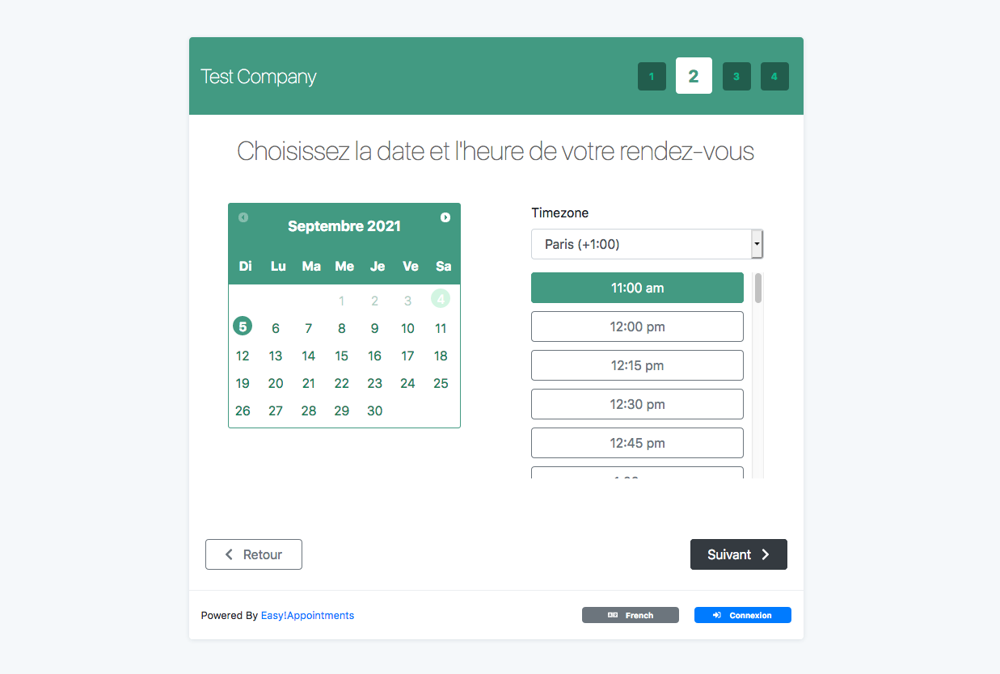

# Easy!Appointments pour YunoHost

[](https://dash.yunohost.org/appci/app/easyappointments)    
[](https://install-app.yunohost.org/?app=easyappointments)

*[Read this readme in english.](./README.md)*
*[Lire ce readme en français.](./README_fr.md)*

> *Ce package vous permet d'installer Easy!Appointments rapidement et simplement sur un serveur YunoHost.
Si vous n'avez pas YunoHost, regardez [ici](https://yunohost.org/#/install) pour savoir comment l'installer et en profiter.*

## Vue d'ensemble

Easy!Appointments is a highly customizable web application that allows customers to book appointments with you via a sophisticated web interface. Moreover, it provides the ability to sync your data with Google Calendar so you can use them with other services. It is an open source project that you can download and install even for commercial use. Easy!Appointments will run smoothly with your existing website as it can be installed in a single folder of the server and of course share an existing database.

### Features
The application is designed to be flexible enough so that it can handle any enterprise work flow.

- Customers and appointments management.
- Services and providers organization.
- Working plan and booking rules.
- Google Calendar synchronization.
- Email notifications system.
- Self hosted installation.
- Translated user interface.


**Version incluse :** 1.4.2~ynh2

**Démo :** https://demo.easyappointments.org/

## Captures d'écran



## Documentations et ressources

* Site officiel de l'app : https://easyappointments.org/
* Documentation officielle de l'admin : https://easyappointments.org/docs.html#1.4.1/readme.md
* Dépôt de code officiel de l'app : https://github.com/alextselegidis/easyappointments
* Documentation YunoHost pour cette app : https://yunohost.org/app_easyappointments
* Signaler un bug : https://github.com/YunoHost-Apps/easyappointments_ynh/issues

## Informations pour les développeurs

Merci de faire vos pull request sur la [branche testing](https://github.com/YunoHost-Apps/easyappointments_ynh/tree/testing).

Pour essayer la branche testing, procédez comme suit.
```
sudo yunohost app install https://github.com/YunoHost-Apps/easyappointments_ynh/tree/testing --debug
ou
sudo yunohost app upgrade easyappointments -u https://github.com/YunoHost-Apps/easyappointments_ynh/tree/testing --debug
```

**Plus d'infos sur le packaging d'applications :** https://yunohost.org/packaging_apps